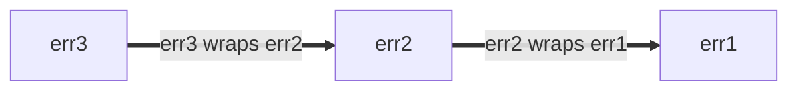

<a id="error-handling"></a>

## Error handling

In Go, [errors are values]; they are created by code and consumed by code.
Errors can be:

*   Converted into diagnostic information for display to humans
*   Used by the maintainer
*   Interpreted by an end user

Error messages also show up across a variety of different surfaces including log
messages, error dumps, and rendered UIs.

Code that processes (produces or consumes) errors should do so deliberately. It
can be tempting to ignore or blindly propagate an error return value. However,
it is always worth considering whether the current function in the call frame is
positioned to handle the error most effectively. This is a large topic and it is
hard to give categorical advice. Use your judgment, but keep the following
considerations in mind:

*   When creating an error value, decide whether to give it any
    [structure](https://github.com/google/styleguide/blob/60d2ac7d89ad526937a52571e5e439e01f0af673/go/best-practices.md#error-structure).
*   When handling an error, consider [adding information](https://github.com/google/styleguide/blob/60d2ac7d89ad526937a52571e5e439e01f0af673/go/best-practices.md#error-extra-info)
    that you have but that the caller and/or callee might not.
*   See also guidance on [error logging](https://github.com/google/styleguide/blob/60d2ac7d89ad526937a52571e5e439e01f0af673/go/best-practices.md#error-logging).

While it is usually not appropriate to ignore an error, a reasonable exception
to this is when orchestrating related operations, where often only the first
error is useful. Package [`errgroup`] provides a convenient abstraction for a
group of operations that can all fail or be canceled as a group.

[errors are values]: https://go.dev/blog/errors-are-values
[`errgroup`]: https://pkg.go.dev/golang.org/x/sync/errgroup

See also:

*   [Effective Go on errors](https://go.dev/doc/effective_go#errors)
*   [A post by the Go Blog on errors](https://go.dev/blog/go1.13-errors)
*   [Package `errors`](https://pkg.go.dev/errors)
*   [Package `upspin.io/errors`](https://commandcenter.blogspot.com/2017/12/error-handling-in-upspin.html)
*   [GoTip #89: When to Use Canonical Status Codes as Errors](https://google.github.io/styleguide/go/index.html#gotip)
*   [GoTip #48: Error Sentinel Values](https://google.github.io/styleguide/go/index.html#gotip)
*   [GoTip #13: Designing Errors for Checking](https://google.github.io/styleguide/go/index.html#gotip)

<a id="error-percent-w"></a>

### Placement of %w in errors

Prefer to place `%w` at the end of an error string *if* you are to use
[error wrapping](https://go.dev/blog/go1.13-errors) with the `%w` formatting
verb.

Errors can be wrapped with the `%w` verb, or by placing them in a
[structured error](https://google.github.io/styleguide/go/index.html#gotip) that
implements `Unwrap() error` (ex:
[`fs.PathError`](https://pkg.go.dev/io/fs#PathError)).

Wrapped errors form error chains: each new layer of wrapping adds a new entry to
the front of the error chain. The error chain can be traversed with the
`Unwrap() error` method. For example:

```go
err1 := fmt.Errorf("err1")
err2 := fmt.Errorf("err2: %w", err1)
err3 := fmt.Errorf("err3: %w", err2)
```

This forms an error chain of the form,



Regardless of where the `%w` verb is placed, the error returned always
represents the front of the error chain, and the `%w` is the next child.
Similarly, `Unwrap() error` always traverses the error chain from newest to
oldest error.

Placement of the `%w` verb does, however, affect whether the error chain is
printed newest to oldest, oldest to newest, or neither:

```go
// Good:
err1 := fmt.Errorf("err1")
err2 := fmt.Errorf("err2: %w", err1)
err3 := fmt.Errorf("err3: %w", err2)
fmt.Println(err3) // err3: err2: err1
// err3 is a newest-to-oldest error chain, that prints newest-to-oldest.
```

```go
// Bad:
err1 := fmt.Errorf("err1")
err2 := fmt.Errorf("%w: err2", err1)
err3 := fmt.Errorf("%w: err3", err2)
fmt.Println(err3) // err1: err2: err3
// err3 is a newest-to-oldest error chain, that prints oldest-to-newest.
```

```go
// Bad:
err1 := fmt.Errorf("err1")
err2 := fmt.Errorf("err2-1 %w err2-2", err1)
err3 := fmt.Errorf("err3-1 %w err3-2", err2)
fmt.Println(err3) // err3-1 err2-1 err1 err2-2 err3-2
// err3 is a newest-to-oldest error chain, that neither prints newest-to-oldest
// nor oldest-to-newest.
```

Therefore, in order for error text to mirror error chain structure, prefer
placing the `%w` verb at the end with the form `[...]: %w`.

<!-- Source: Google Go Style Guide, https://github.com/google/styleguide/blob/60d2ac7d89ad526937a52571e5e439e01f0af673/go/best-practices.md#error-percent-w. Locally segmented; local links rewritten to this pinned revision. -->
